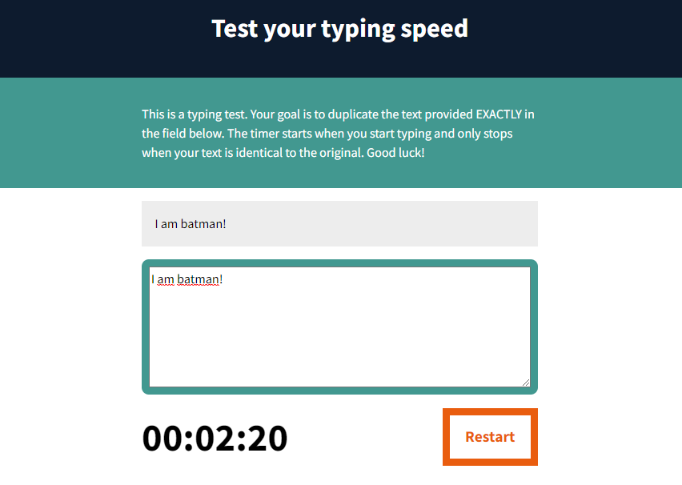

# JS Typing Speed Test ⌨️
### A web application to test the user's typing speed
Project made during the course: [JavaScript: Formação Básica](https://br.linkedin.com/learning/javascript-formacao-basica)

Key learning points:
 - DOM manipulation
 - Events

